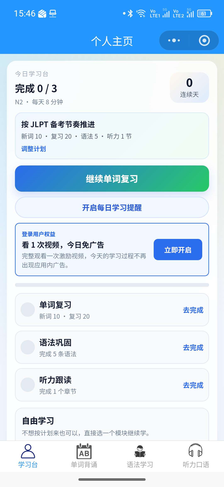
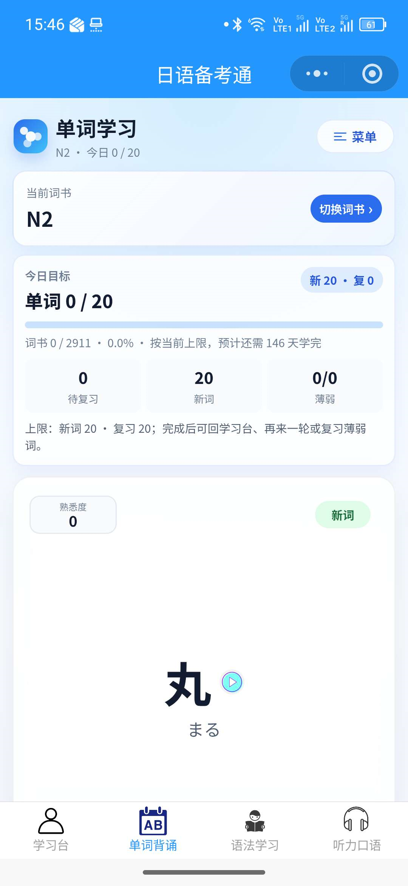
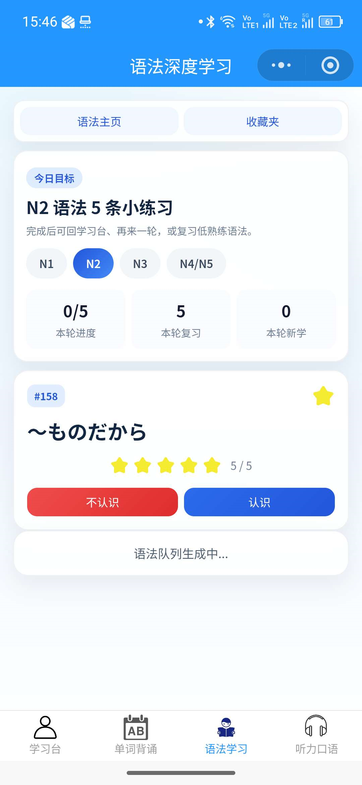

# JapaneseLearning-JLPT

[English](README.md) | 日本語 | [简体中文](README.zh-CN.md)



JLPT対策を目的としたWeChatミニプログラムです。単語、文法、リスニング・シャドーイング、学習記録、復習統計、ユーザープロフィール、ランキングなどの機能が実装されています。

## スクリーンショット

| 単語学習 | 文法学習 |
| --- | --- |
|  |  |

## 主な機能

- JLPT N1、N2、N3、N4/N5別の単語学習
- 文法一覧、集中学習セッション、お気に入り
- リスニングとシャドーイングの練習・進捗記録
- 学習計画、復習統計、定着度に関するユーティリティ
- ログイン、個人学習ダッシュボード、ランキング
- JLPT N1〜N5の得点シミュレーション画面
- WeChat CloudBaseのデータベースとクラウド関数

## 技術スタック

- WeChatミニプログラム
- JavaScript、WXML、WXSS
- WeChat CloudBase
- Node.jsクラウド関数
- `wx-server-sdk`

## ディレクトリ構成

```text
.
├── assets/                 # README用スクリーンショット
├── cloudfunctions/         # クラウド関数
├── miniprogram/
│   ├── data/               # ローカルデータのマニフェスト
│   ├── images/             # UI画像
│   ├── pages/              # 各画面
│   └── utils/              # 学習計画・復習関連処理
├── project.config.json
└── uploadCloudFunction.bat
```

## 必要環境

- WeChat Developer Tools
- WeChatミニプログラムのAppID
- WeChat CloudBase環境
- クラウド関数の依存関係をインストールするためのNode.js

## セットアップ

1. リポジトリをクローンします。

   ```bash
   git clone https://github.com/1xiaohuozi/JapaneseLearning-JLPT.git
   cd JapaneseLearning-JLPT
   ```

2. WeChat Developer Toolsでリポジトリのルートディレクトリをインポートします。
3. CloudBase環境を作成または選択します。
4. 次のファイルにある環境IDを自分の環境IDへ変更します。

   - `miniprogram/app.js`
   - `miniprogram/envList.js`

5. `cloudfunctions/`配下の各関数で依存関係をインストールし、デプロイします。

   - `getLeaderboard`
   - `getnumber`
   - `getOpenId`
   - `getUserOpenId`
   - `getUserReviewStats`
   - `lafService`

6. ソースコードから参照されるCloudBaseコレクションを作成し、データとアクセス権を設定します。
7. WeChat Developer Toolsでコンパイルしてプレビューします。

> `uploadCloudFunction.bat`には特定PCのパスと環境値が含まれています。別の環境で実行する前に編集してください。

## 使い方

- **単語学習**：JLPTレベル別の単語学習
- **文法学習**：文法の閲覧、集中復習、お気に入り
- **リスニング・会話**：リスニングとシャドーイング
- **マイページ**：ログイン、学習進捗、JLPTツール、ランキング

学習履歴やお気に入りの一部はCloudBaseに保存されるため、ログインが必要です。

## 注意事項

- 現在のアプリUIは中国語です。
- クラウド環境IDとデータベース内容はデプロイ環境ごとに設定が必要です。
- リポジトリ内に独立したライセンスファイルはありません。
